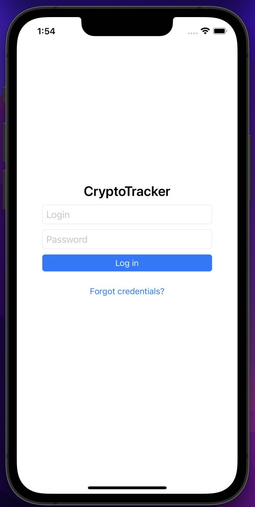
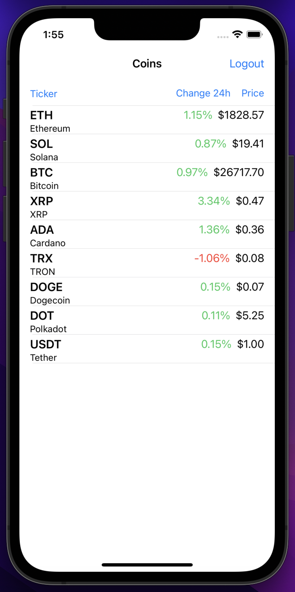
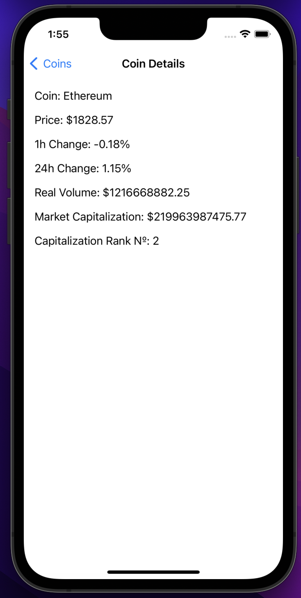

# CryptoTracker

Учебное приложение-криптотрекер. Позволяет авторизоваться (демонстрационно), получить таблицу с монетами и увидеть детальную информацию о каждой из них. 

Было создано в рамках отборочного этапа для стажировки и оттачивания навыков: 

- Работа с API (https://messari.io/api/).
- Использование UserDefaults
- Настройка клавиатуры
- Работа с git
- Использование фильтров
- Работа с таблицами и их возможностями
- Верстка UI кодом
- Работа с router

При первом запуске приложение заправшивает авторизацию (1234/1234), при успешном входе, загружает через АПИ информацию о монетах и рисует таблицу с кастомными ячейками. Таблицу можно проскроллить для обнолвения. Возможно пользоваться фильтрами идеавторизоваться. При клике на моенту открывается более детальная инфомрация о ней. 

    
    
    

## TODO:
- [ ] Привести в порядок архитектуру.
- [ ] Доработать дизайн.
- [ ] Добавить возможность настраивать список получаемых монет из приложения.
- [ ] Реализовать функцию "избранное".
- [ ] Пофиксить работу кнопки Ticker.
- [ ] Выровнять столбец с изменением цены.
- [ ] Выровнять столбец с изменением цены.
